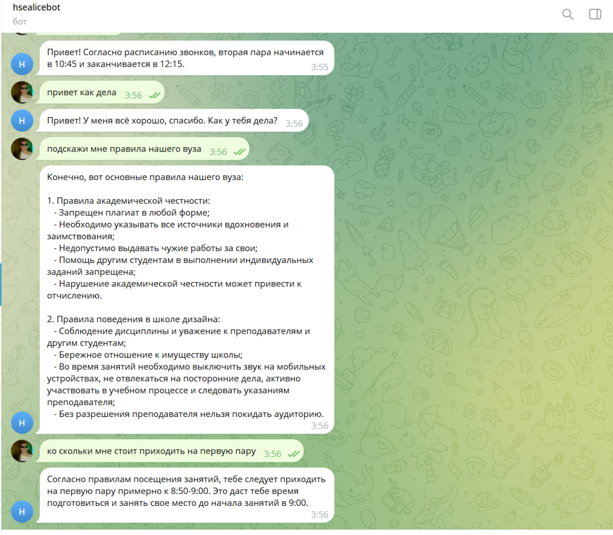

# Чат-бот о правилах поведения в Школе дизайна

Этот проект представляет собой Telegram-бота, который отвечает на вопросы о правилах поведения в Школе дизайна, используя подход Retrieval-Augmented Generation (RAG).

## Как это работает

Бот использует следующие компоненты:
1. **База знаний** - текстовые фрагменты о правилах школы дизайна.
2. **Эмбеддинги** - векторные представления текстовых фрагментов, созданные моделью GigaChat для семантического поиска.
3. **Языковая модель** - GigaChat через библиотеку langchain-gigachat для генерации ответов.
4. **Telegram бот** - интерфейс для взаимодействия с пользователем.

При получении вопроса бот:
1. Конвертирует вопрос в вектор эмбеддинга с помощью модели GigaChat
2. Находит наиболее релевантные фрагменты из базы знаний
3. Отправляет найденные фрагменты и вопрос в модель GigaChat
4. Получает ответ и отправляет его пользователю

## Технологии

- [LangChain](https://python.langchain.com/) - фреймворк для создания приложений с использованием языковых моделей
- [langchain-gigachat](https://python.langchain.com/docs/integrations/chat/gigachat) - интеграция GigaChat с LangChain
- [PyTelegramBotAPI](https://github.com/eternnoir/pyTelegramBotAPI) - библиотека для создания Telegram-ботов

## Установка

1. Клонируйте репозиторий:
```bash
git clone <url-репозитория>
cd <имя-директории>
```

2. Установите зависимости:
```bash
pip install -r requirements.txt
```

3. Создайте файл `.env` с необходимыми переменными окружения:
```
BOT_TOKEN=your_telegram_bot_token_here
GIGACHAT_API_KEY=your_gigachat_api_key_here
GIGACHAT_SCOPE=GIGACHAT_API_PERS
KNOWLEDGE_BASE_PATH=knowledge_base.txt
```

## Запуск бота

```bash
python rag_bot.py
```

Для тестирования без Telegram:
```bash
python test_rag.py
```

## Пример диалога

**Пользователь**: Какие правила поведения на занятиях?

**Бот**: Во время занятий студенты должны выключать звук на мобильных устройствах, не отвлекаться на посторонние дела, не мешать другим студентам, активно участвовать в учебном процессе, следовать указаниям преподавателя и не покидать аудиторию без разрешения преподавателя.

**Пользователь**: Можно ли опаздывать?

**Бот**: Согласно правилам посещения занятий, занятия начинаются строго по расписанию. Студенты должны приходить на занятия за 5-10 минут до начала, чтобы подготовить рабочее место. Опоздавшие студенты могут быть допущены на занятие только с разрешения преподавателя. То есть опаздывать не рекомендуется, но в случае опоздания можно попытаться получить разрешение на посещение занятия от преподавателя.

**Пользователь**: Какое наказание за плагиат?

**Бот**: Согласно правилам академической честности школы дизайна, за нарушение академической честности, включая плагиат в любой форме, студент может быть отчислен. В школе действуют строгие правила, запрещающие плагиат, выдачу чужих работ за свои, а также помощь другим студентам в выполнении индивидуальных заданий.

## Скриншот работы бота

Ниже приведен скриншот диалога с ботом в Telegram, демонстрирующий возможности запоминания контекста:



Этот пример иллюстрирует, как бот может:
1. Отвечать на вопросы о расписании с точными данными
2. Поддерживать личный диалог
3. Предоставлять структурированную информацию о правилах
4. Запоминать контекст разговора и отвечать на связанные вопросы 

## Особенности работы с историей диалога

Бот сохраняет историю диалога для каждого пользователя, что позволяет:

1. Понимать контекст последующих вопросов без необходимости повторять информацию
2. Отвечать на уточняющие вопросы с учетом ранее предоставленной информации
3. Создавать более естественный диалог с пользователем
4. Разрешать неоднозначности в коротких вопросах на основе контекста

В любой момент историю диалога можно сбросить командой `/reset`. 